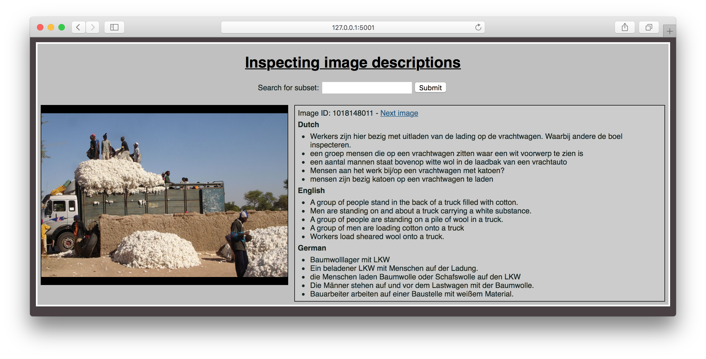

# Cross-lingual comparison

This repository contains a Flask tool to inspect and compare image descriptions
in Dutch, English, and German. Use `python compare_languages.py` to run the tool.
Then go to `http://127.0.0.1:5001/` in your browser to use it.

## Obtaining the images

This repository does not contain the Flickr30K images. Fill in the form on [this page](http://shannon.cs.illinois.edu/DenotationGraph/)
to obtain the images. Put the images from `flickr30k-images.tar` in `./static/images/`.

## Using the comparison tool

Here's a screen shot of the comparison tool.

* Click 'Next image' to browse the descriptions.
* Use the search box to search for a particular word or phrase in any of the
descriptions. You will see a screen with all the results, that you can browse
through.
* To get back to the full set of images, click on the title.
